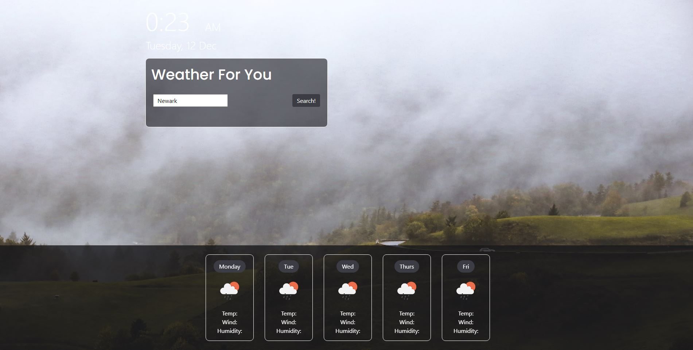

# Weather-API-Application

### License
  
***

## Description
This application allows users to easily find local weather for targeted locations around the world. When the user searches for a location they are presented with a 5 day forcast for that area with information including Temperature, UV index, Humidity, and the wind speed.
***

## Table of Contents
1. [Technologies Used](#technologies)
2. [Screenshots](#screenshots)
3. [Links](#links)
***

## Technologies Used
  
* HTML

* Bootstrap (CSS)

* JavaScript

* OpenWeatherAPI

***

## Screenshots

***

## Links

[Repo-Link](https://github.com/HunterBrennan1/WeatherAPIapp)
***

